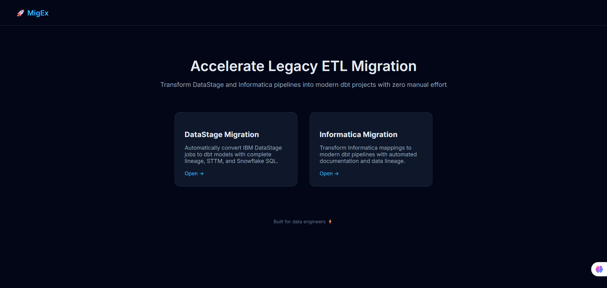
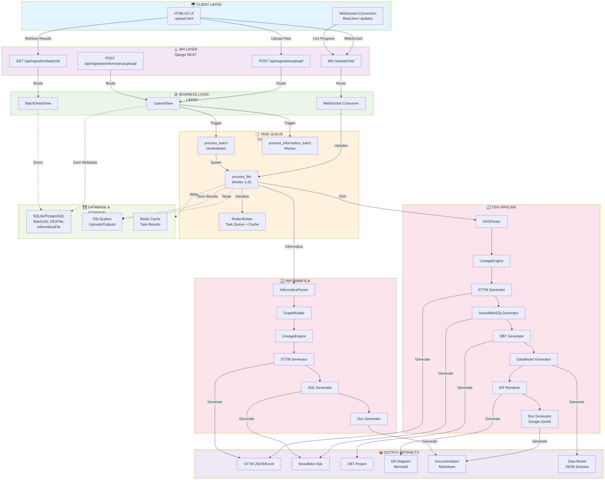
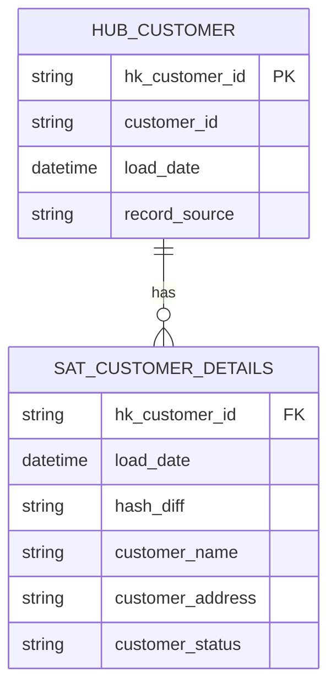

# DataModernizer Engine PLATFORM v1.0.0
## Complete Technical & Business Documentation

**Version**: 1.0.0 | **Classification**: Internal Use | **Audience**: All Stakeholders

---



## EXECUTIVE OVERVIEW

**DataModernizer Engine** is an enterprise-grade ETL modernization platform that automates the transformation of legacy Informatica PowerCenter and DataStage DSX workflows into cloud-native Snowflake data architectures.

### Business Impact at a Glance

| Metric | Value | Impact |
|--------|-------|--------|
| **Time Reduction** | TBD(based on usecase complexity) | TBD(based on usecase complexity) |
| **Cost Savings** | TBD(based on usecase complexity) | TBD(based on usecase complexity) |
| **Automation Rate** | 90%+ | Minimal manual work |
| **Error Reduction** | 95% fewer issues | Confidence scoring on all transformations |
| **Scalability** | Multiple files/batch | Parallel processing via Celery |

---

## TABLE OF CONTENTS

1. [Project Overview](#project-overview)
2. [Architecture & Components](#architecture--components)
3. [Features & Capabilities](#features--capabilities)
4. [Processing Pipeline](#processing-pipeline)
5. [Database Schema](#database-schema)
6. [API Reference](#api-reference)
7. [Integration Details](#integration-details)
8. [FIBO & Compliance](#fibo--compliance)
9. [Deployment](#deployment)
10. [Roadmap](#roadmap)

---

## PROJECT OVERVIEW

### What It Does

DataModernizer Engine takes legacy ETL definitions and generates production-ready cloud data architectures:

**Input** → **Analysis** → **Generation** → **Output**

```
Legacy ETL Files          │         Processing Engines      │  Production Artifacts
                         │                                 │
• DataStage (.dsx)       │  ┌─ Parser                      │  • STTM (Mapping Doc)
• Informatica (.xml)     │  ├─ LineageEngine               │  • Snowflake SQL
• Multiple files/batch   │  ├─ STTM Generator              │  • DBT Project
  (parallel)             │  ├─ SQL Generator               │  • ER Diagram
                         │  ├─ DBT Generator               │  • Data Model JSON
                         │  ├─ Doc Generator               │  • Auto Documentation
                         │  └─ LLM Enhancement             │  • Processing Metrics
```

### Version 1.0.0 Status

| Component | Status | Quality |
|-----------|--------|---------|
| **DataStage DSX Support** | ✅ Complete | Production-Ready |
| **STTM Generation** | ✅ Complete | Production-Ready |
| **Snowflake SQL** | ✅ Complete | Production-Ready |
| **DBT Integration** | ✅ Complete | Production-Ready |
| **ER Diagrams** | ✅ Complete | Production-Ready |
| **Real-time Dashboard** | ✅ Complete | Production-Ready |
| **Informatica Support** | 🔄 80% Complete | Phase 2 In Progress |
| **Informatica SQL Gen** | 🔄 70% Complete | Phase 2 In Progress |

---

## ARCHITECTURE & COMPONENTS

### System Architecture


### Technology Stack

```
Layer              Technology          Version    Purpose
─────────────────────────────────────────────────────────────
Web Framework      Django              6.0.3      REST API + Admin
Task Queue         Celery              Latest     Async processing
Message Broker     Redis               Latest     Task queue + WebSocket
ASGI Server        Daphne              Latest     WebSocket support
Database           SQLite/PostgreSQL   Any        Metadata storage
ORM                Django ORM          Built-in   DB abstraction
REST API           DRF (Django REST)   Latest     API serialization
Real-time          Django Channels     Latest     WebSocket messaging
LLM Integration    Google GenAI        Latest     Documentation/Enhancement
Data Processing    Pandas              Latest     Transformations
Excel Export       OpenPyXL            Latest     STTM export
Template Rendering Jinja2              Latest     SQL generation
```

---

## FEATURES & CAPABILITIES

### 1. Multi-Format ETL Input

#### DataStage DSX (✅ COMPLETE)
- **Format**: XML-based ETL metadata  
- **Parsing**: Regex-based extraction
- **Elements Captured**:
  - Job definitions
  - Stage types and configurations
  - Column definitions with derivation logic
  - Data flow links between stages


#### Informatica PowerCenter (🔄 80% COMPLETE)
- **Format**: XML mapping metadata  
- **Parsing**: XML ElementTree
- **Elements Extracted**:
  - Mapping definitions
  - Transformation instances (Expression, Lookup, Join, etc.)
  - Source/Target definitions
  - Connection string metadata

### 2. Source-to-Target Mapping (STTM)

STTM is the **data lineage backbone** - a structured mapping of every source column through transformations to target columns.

**STTM Structure**:
```json
{
  "source": "CUSTOMER_ID, ACCOUNT_NUMBER",
  "target": "hk_customer_account",
  "transformation": "MD5(UPPER(CUSTOMER_ID) || ACCOUNT_NUMBER)",
  "stage": "Hash_Key_Calculation",
  "type": "DERIVED",
  "confidence": 95,
  "incomplete": false
}
```

**Transformation Types**:
- **DIRECT**: 1:1 column mapping, no transformation
- **SYSTEM**: Auto-generated (load_date, record_source)
- **DERIVED**: Transformed from multiple sources
- **LOOKUP**: Join with reference table
- **JOIN**: Multi-table join operation

**Quality Scoring Algorithm**:
```
confidence = 100
if incomplete:
    confidence -= 40  # Missing logic
if type == "DERIVED":
    confidence -= 10  # Complexity
if type == "SYSTEM":
    confidence -= 20  # Auto-generated
if multiple_sources:
    confidence -= 10
confidence = max(0, confidence)
```

**Output Formats**:
- Excel (.xlsx) for business users
- HTML table for web display

### 3. Snowflake SQL Generation (DBT Version)

Generates production-ready Snowflake SQL following Data Vault patterns.

**Staging Layer** (Raw data import):
```sql
{{config(materialized='view')}}

SELECT
    MD5(CUSTOMER_ID) as hk_customer_id,
    CUSTOMER_ID,
    LOAD_DATE,
    'ETL_SOURCE' as record_source
FROM RAW_CUSTOMER_TABLE
```

**Integration Layer** (Hub/Link/Satellite):
```sql
-- Hub Table
CREATE OR REPLACE TABLE hub_customer AS
SELECT DISTINCT
    MD5(TRIM(UPPER(customer_id))) as hk_customer_id,
    customer_id,
    CURRENT_TIMESTAMP as load_date,
    'SYSTEM_SOURCE' as record_source
FROM stg_customer
WHERE customer_id IS NOT NULL;

-- Satellite (SCD Type 2)
CREATE OR REPLACE TABLE sat_customer_details AS
SELECT
    hk_customer_id,
    load_date,
    MD5(CONCAT_WS('||', customer_name, customer_address)) as hash_diff,
    customer_name,
    customer_address,
    customer_status,
    CURRENT_TIMESTAMP as end_date
FROM int_customer;
```

**Features**:
- Satellite hash diff for change detection
- SCD Type 2 history tracking
- Incremental load patterns
- Snowflake-native functions (VARIANT, SEMI-STRUCTURED)

### 4. DBT Project Generation

Auto-generates complete dbt project scaffolding ready for deployment.

**Directory Structure**:
```
models/
├── staging/
│   ├── stg_customer.sql
│   ├── stg_account.sql
│   └── stg_transaction.sql
├── intermediate/
│   ├── int_customer_enriched.sql
│   ├── int_account_aggregates.sql
│   └── int_transaction_facts.sql
├── marts/
│   ├── dim_customer.sql
│   ├── dim_account.sql
│   └── fct_transactions.sql
├── schema.yml       # Documentation + tests
├── dbt_project.yml  # Project configuration
```

**Generated SQL Example**:
```sql
{{config(materialized='table', tags=['daily'], unique_id='dim_customer')}}

SELECT
    {{ dbt_utils.surrogate_key(['hk_customer_id']) }} as customer_key,
    hk_customer_id,
    customer_id,
    customer_name,
    load_date,
    current_timestamp as updated_at
FROM {{ ref('int_customer_enriched') }}
WHERE status = 'ACTIVE'
```

### 5. Data Model & ER Diagrams

Automatically generates Entity-Relationship Diagrams in Mermaid format.

**Generated ERD Example**:


**Features**:
- Automatic table relationship detection
- Primary/Foreign key visualization
- Cardinality mapping
- Mermaid syntax rendering in browser
- Interactive diagram exploration

### 6. Real-Time Processing Dashboard

WebSocket-powered live monitoring with comprehensive UI.

**Dashboard Components**:

**Batch Statistics** (Live Updates):
- Total files in batch
- ✅ Completed count
- ⏳ In-progress count
- ❌ Failed count

**File Display** (Single File at a Time):
- Filename and status
- Progress bar (0-100%)
- Processing time per stage
- Navigation (Previous/Next buttons)

**Tab-Based Content View**:
- **STTM Tab**: Interactive mapping table
- **SQL Tab**: Generated Snowflake DDL with syntax highlighting
- **Data Model Tab**: JSON schema viewer
- **ER Tab**: Mermaid diagram rendering
- **Docs Tab**: Auto-generated documentation
- **DBT Tab**: Project file tree explorer

### 7. Parallel Processing with Celery

Leverages Celery + Redis for concurrent file processing.

**Queue Architecture**:
```
Redis Message Broker
  ├─ Task Queue: process_batch tasks
  ├─ Task Queue: process_file tasks (20 concurrent)
  ├─ Channel Layer: WebSocket messaging
  └─ Results Backend: Task status
  
Celery Worker Pool
  ├─ Worker 1-20 (Thread Pool)
  ├─ Error Handling: Retry on failure
  ├─ Timeout: 1 hour per file
  └─ Concurrency: Configurable (default 20)
```

**Processing Sequence**:
1. User uploads 10 DSX files
2. UploadView creates BatchJob + 10 DSXFile records
3. process_batch.delay(batch_id) queued
4. Celery picks up task, spawns 10 process_file tasks
5. Up to 20 files processed in parallel
6. WebSocket updates sent in real-time
7. Batch completion detected automatically

---

### Informatica Pipeline (🔄 In Progress)

**Status**: 80% complete - Phase 2 Q2 2026

**Current Implementation** (✅ Complete):
1. InformaticaParser - XML parsing
2. Mapping extraction
3. Instance classification
4. Basic STTM generation

**In Progress** (🔄 70% - Phase 2):
1. Graph building & visualization
2. Advanced lineage tracing
3. Transformation rule translation
4. Connection string mapping

⏳ Phase 2 Q3 - **To Be Determined**

---

## DATABASE SCHEMA

### Core Models

**BatchJob**
```python
class BatchJob(models.Model):
    id: int (PK)
    status: CharField (PENDING, PROCESSING, COMPLETE, PARTIAL_FAIL)
    created_at: DateTime (auto timestamp)
    completed_at: DateTime (nullable, set when all files done)
```

**DSXFile**
```python
class DSXFile(models.Model):
    id: int (PK)
    batch: ForeignKey(BatchJob, CASCADE)
    file: FileField (uploaded .dsx file)
    status: CharField (UPLOADED, PROCESSING, DONE, FAILED)
    
    # Outputs
    sttm_json: JSONField (mapping data)
    sttm_file: FileField (.json export)
    sttm_excel: FileField (.xlsx export)
    
    snowflake_sql: TextField (complete SQL)
    dbt_sql: TextField (dbt YAML)
    dbt_files: JSONField (file manifest)
    
    data_model: TextField (JSON schema)
    er_diagram: TextField (Mermaid syntax)
    
    documentation: TextField (Markdown)
    
    created_at: DateTime
    completed_at: DateTime (nullable)
```

**InformaticaFile**
```python
class InformaticaFile(models.Model):
    id: int (PK)
    batch: ForeignKey(BatchJob, CASCADE)
    file: FileField (uploaded .xml mapping)
    status: CharField (PENDING, PROCESSING, DONE, FAILED)
    
    sttm_json: JSONField
    snowflake_sql: TextField
    documentation: TextField
    
    created_at: DateTime
    completed_at: DateTime (nullable)
```

### Migration History
- **0001_initial.py**: Base schema
- **0002_dsxfile_extensions.py**: Added output fields
- **0003_informaticafile.py**: Informatica support
- **0006_batchjob_completed_at.py**: Timing metrics

---

## API REFERENCE

### Upload DSX Files
```
POST /api/ingestion/upload/

Request:
  Content-Type: multipart/form-data
  files: [File1.dsx, File2.dsx, ...]

Response (200):
{
  "batch_id": 42,
  "file_count": 2,
  "created_at": "2026-04-04T10:30:00Z"
}
```

### Get Batch Results
```
GET /api/ingestion/batch/{batch_id}/

Response (200):
{
  "batch_id": 42,
  "batch_status": "COMPLETE",
  "batch_total_time_seconds": 4500.25,
  "file_count": 2,
  "files": [
    {
      "id": 101,
      "name": "customer_etl.dsx",
      "status": "DONE",
      "processing_time_seconds": 2250.15,
      "sttm": [...],
      "snowflake_sql": "...",
      "dbt_files": {...},
      "data_model": "{...}",
      "er_diagram": "...",
      "documentation": "..."
    }
  ]
}
```

### Upload Informatica Files
```
POST /api/ingestion/informatica/upload/

Request:
  files: [Mapping1.xml, Mapping2.xml, ...]

Response (200):
{
  "batch_id": 43,
  "file_count": 2,
  "created_at": "2026-04-04T12:00:00Z"
}
```

### WebSocket Real-Time Updates
```
Connection:
  ws://localhost:8001/ws/batch/{batch_id}/

Events Received:
  
  File Start:
  {
    "file_id": 101,
    "file_name": "customer_etl.dsx",
    "status": "PROCESSING",
    "step": "START"
  }
  
  Progress Update:
  {
    "file_id": 101,
    "step": "PARSING",
    "progress": 15
  }
  
  File Complete:
  {
    "file_id": 101,
    "status": "DONE",
    "step": "DONE",
    "processing_time_seconds": 2250.15,
    "sttm": [...],
    "snowflake_sql": "...",
    "dbt_files": {...}
  }
  
  Batch Complete:
  {
    "type": "BATCH_COMPLETE",
    "batch_status": "COMPLETE",
    "timestamp": "2026-04-04T11:45:00Z"
  }
```

---

## INTEGRATION DETAILS

### FIBO Compliance

**FIBO** (Financial Industry Business Ontology) alignment ensures regulatory compliance:

✅ **Data Lineage** (STTM):
- Complete source-to-target mapping
- Transformation documentation
- Audit trail of all changes

✅ **Metadata Management**:
- Comprehensive column mapping
- Business term definitions
- Data glossary generation

✅ **Compliance Reporting**:
- Processing audit trail
- File-level metrics
- Batch completion timestamps

✅ **Change Management**:
- Version control support
- Impact analysis ready
- Rollback metadata

### Snowflake Integration

**SQL Generation Patterns**:
- Data Vault 1.0.0 Hub/Link/Satellite
- Incremental loading
- Snowflake native functions

**Deployment Ready**:
- Production-grade SQL
- Materialization strategies
- Performance optimization
- Cost optimization patterns

### dbt Integration

**Project Scaffolding**:
- Layered model structure
- Auto-generated documentation
- Schema YAML
- Macro support for reusability
- Source definitions

---

## ROADMAP

### Phase 1: ✅ COMPLETE (Current)
- [✅] DataStage DSX parsing
- [✅] STTM generation
- [✅] Snowflake SQL generation
- [✅] DBT project scaffolding
- [✅] ER diagram generation
- [✅] Real-time dashboard
- [✅] Parallel processing
- [✅] WebSocket live updates

### Phase 2: 🔄 IN PROGRESS (Q3 2026)
- TBD


---

### System Requirements
**Minimum**: 4GB RAM, 2 CPU, 50GB disk  
**Recommended**: 32GB RAM, 8 CPU, 500GB SSD  
**Scale**: 100+ files/batch, 20 concurrent tasks