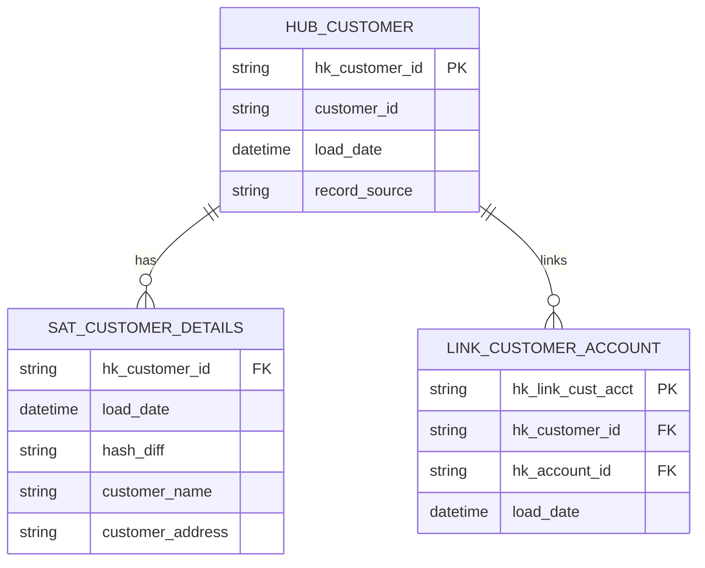

# MigEx v2.0
## Technical Architecture & Implementation Guide

**Version**: 2.0 | **Audience**: Engineers, Architects, DevOps | **Date**: April 2026

---

## TABLE OF CONTENTS
1. [System Architecture](#system-architecture)
2. [Component Deep Dive](#component-deep-dive)
3. [Data Processing Engines](#data-processing-engines)
4. [Database Design](#database-design)
5. [API Contracts](#api-contracts)
6. [Deployment Architecture](#deployment-architecture)
7. [Performance & Scalability](#performance--scalability)
8. [Monitoring & Observability](#monitoring--observability)

---

## SYSTEM ARCHITECTURE

### Architecture Diagram

```
┌─────────────────────────────────────────────────────────────┐
│ CLIENT LAYER                                                │
│ ┌─────────────────┐  ┌───────────────────────────────────┐ │
│ │ HTML/JavaScript │  │ WebSocket Connection (Real-time) │ │
│ │ (upload.html)   │  │ Message Queue Updates (Live)      │ │
│ └─────────────────┘  └───────────────────────────────────┘ │
└────────────────────────┬──────────────────────────────────────┘
                         │
┌────────────────────────▼──────────────────────────────────────┐
│ API LAYER (Django REST Framework)                           │
│ POST   /api/ingestion/upload/          (Create batch)      │
│ GET    /api/ingestion/batch/{id}/      (Get results)       │
│ POST   /api/ingestion/informatica/     (Informatica)       │
│ WS     /ws/batch/{id}/                 (WebSocket)         │
└────────────────────────┬──────────────────────────────────────┘
                         │
┌────────────────────────▼──────────────────────────────────────┐
│ VIEW LAYER (Django Views + Channels Consumer)               │
│ • UploadView: File ingestion & batch creation              │
│ • BatchDetailView: Results aggregation                      │
│ • InformaticaUploadView: Informatica routing               │
│ • BatchConsumer: WebSocket message broadcasting             │
└────────────────────────┬──────────────────────────────────────┘
                         │
┌────────────────────────▼──────────────────────────────────────┐
│ TASK ORCHESTRATION (Celery + Redis)                         │
│                                                              │
│ Celery Broker (Redis)   →   Task Queue                      │
│   ├─ process_batch                                          │
│   ├─ process_file (DSX)                                     │
│   ├─ process_informatica_batch                              │
│   └─ process_informatica_file                               │
│                                                              │
│ Celery Worker Pool (Threads)                                │
│   ├─ Concurrency: 20 tasks                                  │
│   ├─ Timeout: 3600s (1 hour)                               │
│   ├─ Retries: 2 attempts                                    │
│   └─ Backoff: exponential                                   │
│                                                              │
│ Result Backend (Redis)                                      │
│   └─ Task status, completion signals                        │
│                                                              │
│ Channel Layer (Redis)                                       │
│   └─ WebSocket message distribution                         │
└────────────────────────┬──────────────────────────────────────┘
                         │
┌────────────────────────▼──────────────────────────────────────┐
│ PROCESSING ENGINES                                           │
│                                                              │
│ ┌──────────────────────┐    ┌──────────────────────────┐   │
│ │ DSX PIPELINE         │    │ INFORMATICA PIPELINE     │   │
│ │ ├─ Parser (Regex)    │    │ ├─ Parser (XML)         │   │
│ │ ├─ Lineage Engine    │    │ ├─ Graph Builder        │   │
│ │ ├─ STTM Generator    │    │ ├─ Lineage Engine       │   │
│ │ ├─ SQL Generator     │    │ ├─ STTM Generator       │   │
│ │ ├─ DBT Generator     │    │ ├─ SQL Generator        │   │
│ │ ├─ Data Model Gen    │    │ ├─ DBT Generator        │   │
│ │ ├─ ER Renderer       │    │ └─ Doc Generator        │   │
│ │ └─ LLM Enhancement   │    └──────────────────────────┘   │
│ └──────────────────────┘    (80% complete, Phase 2 Q3)     │
│ (100% complete, production)                                │
│                                                              │
│ Shared Utilities                                            │
│   ├─ WebSocket messaging (send_ws_update)                  │
│   ├─ Database operations (ORM)                             │
│   └─ File management (storage)                             │
└────────────────────────┬──────────────────────────────────────┘
                         │
┌────────────────────────▼──────────────────────────────────────┐
│ PERSISTENCE LAYER                                           │
│                                                              │
│ ┌──────────────────┐  ┌──────────┐  ┌────────────────────┐ │
│ │ Database         │  │ Redis    │  │ File System        │ │
│ │ (SQLite/PG)      │  │ (Cache)  │  │ (Media Storage)    │ │
│ │                  │  │          │  │                    │ │
│ │ • BatchJob       │  │ • Queues │  │ • Uploaded files   │ │
│ │ • DSXFile        │  │ • Cache  │  │ • STTM exports     │ │
│ │ • InformaticaFile│  │ • Channels  │ • SQL files        │ │
│ │ • Migrations     │  │          │  │ • DBT projects     │ │
│ └──────────────────┘  └──────────┘  └────────────────────┘ │
└──────────────────────────────────────────────────────────────┘
```

### Component Interactions

```
User Upload Flow:
1. User Browser → POST /api/ingestion/upload/ (files)
2. UploadView → Create BatchJob + DSXFile records
3. UploadView → Trigger process_batch.delay(batch_id)
4. Response → {batch_id, file_count, created_at}

Processing Flow:
5. Celery Worker → Pick up process_batch task
6. process_batch() → For each file: process_file.delay(file_id)
7. Celery Pool → (Up to 20 parallel process_file tasks)
8. process_file() → Execute 9-step pipeline (see below)
9. Each step → send_ws_update() via Redis channels
10. WebSocket → Browser receives real-time updates

Result Retrieval:
11. GET /api/ingestion/batch/{batch_id}/
12. BatchDetailView → Query batch + all files
13. Response → Complete results JSON + all artifacts

Browser Rendering:
14. JavaScript → Render results in tab-based UI
15. Display → STTM, SQL, ER, DBT, Docs tabs
16. Navigate → File thumbnails, Previous/Next
```

---

## COMPONENT DEEP DIVE

### 1. DSXParser (`processing/parser.py`)

**Purpose**: Extract ETL metadata from .dsx XML files

**Implementation**:
```python
class DSXParser:
    def parse(file_path: str) -> dict:
        """
        Parse DSX file and extract structured metadata
        
        Returns:
        {
            "job_name": str,
            "stages": {
                "stage_name": {
                    "type": str,
                    "inputs": [str],
                    "outputs": [{"name": str, "derivation": str}]
                }
            },
            "links": [{"from": str, "to": str}]
        }
        """
        with open(file_path, 'r', encoding='utf-8') as f:
            content = f.read()
        
        return {
            "job_name": self.extract_job_name(content),
            "stages": self.extract_stages(content),
            "links": self.extract_links(content)
        }
    
    def extract_job_name(content: str) -> str:
        # Regex: r'Identifier "(.*?)"' - captures job identifier
        match = re.search(r'Identifier "(.*?)"', content)
        return match.group(1) if match else "UNKNOWN"
    
    def extract_stages(content: str) -> dict:
        # Regex: r'BEGIN STAGE(.*?)END STAGE' - captures stage blocks
        stages = {}
        for block in re.findall(r'BEGIN STAGE(.*?)END STAGE', content, re.DOTALL):
            name = self._extract(r'Identifier "(.*?)"', block)
            stage_type = self._extract(r'StageType "(.*?)"', block)
            stages[name] = {
                "type": stage_type,
                "inputs": self.extract_inputs(block),
                "outputs": self.extract_columns(block)
            }
        return stages
    
    def extract_columns(block: str) -> list:
        # Regex: r'BEGIN COLUMN(.*?)END COLUMN'
        columns = []
        for col_block in re.findall(r'BEGIN COLUMN(.*?)END COLUMN', block, re.DOTALL):
            name = self._extract(r'Name "(.*?)"', col_block)
            derivation = self._extract(r'Derivation "(.*?)"', col_block)
            columns.append({"name": name, "derivation": derivation})
        return columns
    
    def extract_links(content: str) -> list:
        # Regex: r'BEGIN LINK(.*?)END LINK'
        links = []
        for block in re.findall(r'BEGIN LINK(.*?)END LINK', content, re.DOTALL):
            from_stage = self._extract(r'FromStage "(.*?)"', block)
            to_stage = self._extract(r'ToStage "(.*?)"', block)
            links.append({"from": from_stage, "to": to_stage})
        return links
```

**Performance**: O(file_size) - Single pass regex parsing

### 2. LineageEngine (`processing/lineage.py`)

**Purpose**: Build column-level data lineage

**Algorithm**:
```python
class LineageEngine:
    def __init__(self, parsed: dict):
        self.stages = parsed["stages"]
        self.links = parsed["links"]
    
    def run(self) -> list[dict]:
        """
        Build complete column lineage across all stages
        
        For each stage:
          For each output column:
            1. Extract source column names from derivation
            2. Build path from source through transformations
            3. Generate lineage entry
        """
        lineage = []
        
        for stage_name, stage in self.stages.items():
            for col in stage["outputs"]:
                target = col["name"]
                derivation = col.get("derivation")
                
                # Extract source columns
                if derivation:
                    sources = self.extract_sources(derivation)
                else:
                    sources = [target]  # Direct pass-through
                
                lineage.append({
                    "source": ", ".join(sources),
                    "target": target,
                    "transformation": derivation or "Direct mapping",
                    "stage": stage_name
                })
        
        return lineage
    
    def extract_sources(derivation: str) -> list[str]:
        """Extract unique column names from derivation expression"""
        # Regex: r'[A-Za-z_][A-Za-z0-9_]*' - matches identifiers
        tokens = re.findall(r'[A-Za-z_][A-Za-z0-9_]*', derivation)
        
        # Filter out SQL keywords
        keywords = {"If", "Then", "Else", "And", "Or", "IsNull", ...}
        return list(set([t for t in tokens if t not in keywords]))
```

**Output Example**:
```json
[
  {
    "source": "CUSTOMER_ID",
    "target": "hk_customer_id",
    "transformation": "MD5(CUSTOMER_ID)",
    "stage": "Hash_Key_Calc"
  },
  {
    "source": "LOAD_TIMESTAMP",
    "target": "load_date",
    "transformation": "Direct mapping",
    "stage": "Source_Adapter"
  }
]
```

### 3. STTM Generator (`agent/agent.py` - generate_sttm_from_lineage)

**Purpose**: Generate STTM with quality scoring

**Confidence Calculation**:
```python
def calculate_confidence(type: str, transformation: str, incomplete: bool) -> int:
    """Calculate confidence score 0-100"""
    confidence = 100
    
    if incomplete:
        confidence -= 40  # Incomplete transformations
    if type == "DERIVED":
        confidence -= 10  # Multi-source complexity
    if type == "SYSTEM":
        confidence -= 20  # Auto-generated fields
    if "," in source:
        confidence -= 10  # Multiple sources
    
    return max(0, confidence)
```

**Incompleteness Detection**:
- Unbalanced SQL quotes
- Missing THEN/ELSE clauses
- Incomplete conditional logic
- Malformed function calls

**Output Structure**:
```json
[
  {
    "source": "CUSTOMER_ID, ACCOUNT_NUMBER",
    "target": "hk_customer_account",
    "transformation": "MD5(UPPER(CUSTOMER_ID) || ACCOUNT_NUMBER)",
    "stage": "Hash_Key_Calc",
    "type": "DERIVED",
    "confidence": 92,
    "incomplete": false
  }
]
```

### 4. SnowflakeSQLGenerator (`processing/sql_generator.py`)

**Generated Layers**:

**1. Staging (View)**:
```sql
{{config(materialized='view')}}

SELECT
    MD5(TRIM(UPPER(customer_id))) as hk_customer_id,
    customer_id,
    customer_name,
    account_number,
    CURRENT_TIMESTAMP as load_date,
    'ETL_SOURCE' as record_source
FROM RAW_CUSTOMER_TABLE
WHERE customer_id IS NOT NULL
```

**2. Hub (Table)**:
```sql
{{config(materialized='table', 
         cluster_by=['hk_customer_id', 'load_date'])}}

SELECT DISTINCT
    MD5(TRIM(UPPER(customer_id))) as hk_customer_id,
    customer_id,
    CURRENT_TIMESTAMP as load_date,
    'SYSTEM' as record_source
FROM {{ ref('stg_customer') }}
```

**3. Satellite (Table with SCD Type 2)**:
```sql
{{config(materialized='incremental')}}

SELECT
    hk_customer_id,
    load_date,
    MD5(CONCAT_WS('||', 
        UPPER(customer_name),
        UPPER(customer_address))) as hash_diff,
    customer_name,
    customer_address,
    CURRENT_TIMESTAMP as end_date
FROM {{ ref('int_customer') }}


  WHERE load_date > (SELECT MAX(load_date) FROM {{ this }})

```

### 5. DBT Generator (`processing/dbt_generator.py`)

**Generated Files**:
```
dbt/
├── models/
│   ├── staging/
│   │   ├── stg_customer.sql
│   │   ├── stg_account.sql
│   │   └── stg_transaction.sql
│   ├── intermediate/
│   │   ├── int_customer_enriched.sql
│   │   ├── int_account_facts.sql
│   │   └── int_transaction_facts.sql
│   ├── marts/
│   │   ├── dim_customer.sql
│   │   ├── dim_account.sql
│   │   └── fct_transactions.sql
│   ├── schema.yml
│   ├── dbt_project.yml
│   └── packages.yml
```

**Example stg_customer.sql**:
```sql
{{config(materialized='view')}}



SELECT
    
    {{ col }},
    ,
    CURRENT_TIMESTAMP as load_timestamp
FROM {{ source('raw', 'customer_data') }}
```

### 6. Data Model Generator

**Process**:
1. Parse Snowflake SQL for CREATE TABLE statements
2. Extract columns and data types
3. Detect primary/foreign key patterns
4. Build JSON schema

**Output**:
```json
{
  "tables": [
    {
      "name": "HUB_CUSTOMER",
      "type": "Hub",
      "columns": [
        {"name": "hk_customer_id", "type": "STRING", "pk": true},
        {"name": "customer_id", "type": "STRING", "bk": true},
        {"name": "load_date", "type": "DATETIME"},
        {"name": "record_source", "type": "STRING"}
      ]
    }
  ],
  "relationships": [
    {
      "source": "HUB_CUSTOMER",
      "target": "SAT_CUSTOMER_DETAILS",
      "type": "1:M",
      "fk": "hk_customer_id"
    }
  ]
}
```

### 7. ER Diagram Renderer

**Mermaid Generation**:


### 8. InformaticaParser (🔄 Phase 2)

**Status**: 80% complete

**Done** ✅:
- XML parsing (ElementTree)
- Mapping extraction
- Transformation classification
- Instance grouping

**In Progress** 🔄:
- Advanced transformation rules
- Expression rule translation
- Lookup/Join pattern normalization

**To Do** ⏳:
- Session parameters
- Workflow orchestration
- Connection string mapping

---

## DATABASE DESIGN

### Schema Diagram

```
BatchJob (Main Entity)
├── id (PK)
├── status (PENDING | PROCESSING | COMPLETE | PARTIAL_FAIL)
├── created_at (DateTime)
└── completed_at (DateTime, nullable)
    │
    ├─→ DSXFile (1:Many)
    │   ├── id (PK)
    │   ├── batch_id (FK)
    │   ├── file (FileField)
    │   ├── status (UPLOADED | PROCESSING | DONE | FAILED)
    │   ├── sttm_json (JSONField)
    │   ├── sttm_file (FileField)
    │   ├── sttm_excel (FileField)
    │   ├── snowflake_sql (TextField)
    │   ├── dbt_sql (TextField)
    │   ├── dbt_files (JSONField)
    │   ├── data_model (TextField)
    │   ├── er_diagram (TextField)
    │   ├── documentation (TextField)
    │   ├── created_at (DateTime)
    │   └── completed_at (DateTime, nullable)
    │
    └─→ InformaticaFile (1:Many)
        ├── id (PK)
        ├── batch_id (FK)
        ├── file (FileField)
        ├── status (PENDING | PROCESSING | DONE | FAILED)
        ├── sttm_json (JSONField)
        ├── snowflake_sql (TextField)
        ├── documentation (TextField)
        ├── created_at (DateTime)
        └── completed_at (DateTime, nullable)
```

### Indexes
```sql
CREATE INDEX idx_batch_status ON ingestion_batchjob(status);
CREATE INDEX idx_batch_created ON ingestion_batchjob(created_at);
CREATE INDEX idx_dsx_batch ON ingestion_dsxfile(batch_id);
CREATE INDEX idx_dsx_status ON ingestion_dsxfile(status);
CREATE INDEX idx_dsx_batch_status ON ingestion_dsxfile(batch_id, status);
```

---

## API CONTRACTS

### Authentication
None currently (add OAuth2 in Phase 3)

### Request/Response Specifications

**POST /api/ingestion/upload/**
```
Request Headers:
  Content-Type: multipart/form-data

Request Body:
  files: File[] (multiple DSX files)
  
Response (200 OK):
  {
    "batch_id": 42,
    "file_count": 2,
    "created_at": "2026-04-04T10:30:00Z"
  }

Response (400 Bad Request):
  {
    "error": "No files provided",
    "code": "EMPTY_FILES"
  }

Response (413 Payload Too Large):
  {
    "error": "File size exceeds 500MB",
    "code": "FILE_TOO_LARGE"
  }
```

**GET /api/ingestion/batch/{batch_id}/**
```
Response (200 OK):
  {
    "batch_id": 42,
    "batch_status": "COMPLETE",
    "batch_created_at": "2026-04-04T10:30:00Z",
    "batch_completed_at": "2026-04-04T11:45:00Z",
    "batch_total_time_seconds": 4500.25,
    "file_count": 2,
    "files": [
      {
        "id": 101,
        "name": "transaction_etl.dsx",
        "status": "DONE",
        "processing_time_seconds": 420.15,
        "sttm": [...],
        "snowflake_sql": "CREATE TABLE ...",
        "dbt_sql": "version: 2\n...",
        "dbt_files": {...},
        "data_model": "{...}",
        "er_diagram": "erDiagram ...",
        "documentation": "## Transaction ETL\n..."
      },
      {
        "id": 102,
        "name": "customer_etl.dsx",
        "status": "FAILED",
        "error": "Parsing error: Invalid XML structure"
      }
    ]
  }

Response (404 Not Found):
  {
    "error": "Batch not found",
    "code": "BATCH_NOT_FOUND"
  }
```

### WebSocket Events

**Connection**:
```
ws://localhost:8001/ws/batch/{batch_id}/
```

**Event: File Processing Started**:
```json
{
  "file_id": 101,
  "file_name": "customer_etl.dsx",
  "status": "PROCESSING",
  "step": "START",
  "progress": 0
}
```

**Event: Processing Progress**:
```json
{
  "file_id": 101,
  "step": "PARSING",
  "progress": 10
}
```

**Event: Stage Completion**:
```json
{
  "file_id": 101,
  "step": "STTM_GENERATED",
  "progress": 30,
  "sttm": [
    {
      "source": "CUSTOMER_ID",
      "target": "hk_customer_id",
      "transformation": "MD5(CUSTOMER_ID)",
      "confidence": 95
    }
  ]
}
```

**Event: File Complete**:
```json
{
  "file_id": 101,
  "file_name": "customer_etl.dsx",
  "status": "DONE",
  "step": "DONE",
  "progress": 100,
  "processing_time_seconds": 420.15,
  "sttm": [...],
  "snowflake_sql": "...",
  "dbt_files": {...},
  "data_model": "...",
  "documentation": "..."
}
```

**Event: Batch Complete**:
```json
{
  "type": "BATCH_COMPLETE",
  "batch_status": "COMPLETE",
  "timestamp": "2026-04-04T11:45:00Z"
}
```

---

## DEPLOYMENT ARCHITECTURE

### Development

```bash
# Start services
python manage.py runserver         # Django on 8000
celery -A dsx_platform worker     # Celery worker
daphne -b 0.0.0.0 -p 8001 \      # Daphne WebSocket
  dsx_platform.asgi:application

# Access
http://localhost:8000
```

### Production (Docker Compose)

```yaml
version: '3'
services:
  django:
    image: dsx:v2.0
    command: gunicorn dsx_platform.wsgi --bind 0.0.0.0:8000
    ports:
      - "8000:8000"
    env_file: .env.prod
  
  celery-worker:
    image: dsx:v2.0
    command: celery -A dsx_platform worker -l info --concurrency=20
    env_file: .env.prod
    depends_on:
      - redis
  
  daphne:
    image: dsx:v2.0
    command: daphne -b 0.0.0.0 -p 8001 dsx_platform.asgi:application
    ports:
      - "8001:8001"
    env_file: .env.prod
  
  postgres:
    image: postgres:15
    volumes:
      - postgres_data:/var/lib/postgresql/data
    environment:
      POSTGRES_DB: dsx_prod
      POSTGRES_PASSWORD: ${DB_PASSWORD}
  
  redis:
    image: redis:7-alpine
    volumes:
      - redis_data:/data
    command: redis-server --appendonly yes
```

### Production (Kubernetes)

```yaml
apiVersion: apps/v1
kind: Deployment
metadata:
  name: dsx-django
spec:
  replicas: 3
  selector:
    matchLabels:
      app: dsx-django
  template:
    metadata:
      labels:
        app: dsx-django
    spec:
      containers:
      - name: django
        image: dsx:v2.0
        ports:
        - containerPort: 8000
        env:
        - name: DATABASE_URL
          valueFrom:
            secretKeyRef:
              name: db-credentials
              key: url
        resources:
          requests:
            memory: "1Gi"
            cpu: "500m"
          limits:
            memory: "2Gi"
            cpu: "1000m"
---
apiVersion: apps/v1
kind: Deployment
metadata:
  name: dsx-celery-worker
spec:
  replicas: 5  # Auto-scale based on queue
  selector:
    matchLabels:
      app: dsx-worker
  template:
    metadata:
      labels:
        app: dsx-worker
    spec:
      containers:
      - name: celery
        image: dsx:v2.0
        command: 
          - celery
          - -A
          - dsx_platform
          - worker
          - -l
          - info
          - --concurrency=20
        resources:
          requests:
            memory: "2Gi"
            cpu: "1000m"
          limits:
            memory: "4Gi"
            cpu: "2000m"
```

---

## PERFORMANCE & SCALABILITY

### Benchmarks

```
File Size    Processing Time    Throughput
─────────────────────────────────────────
< 1 MB       30-60 seconds     60-120 files/hour
1-10 MB      2-5 minutes       12-30 files/hour
10-100 MB    10-30 minutes     2-6 files/hour
> 100 MB     30-60 minutes     < 2 files/hour
```

### Resource Requirements

**Development**:
- RAM: 4GB
- CPU: 2 cores
- Disk: 50GB

**Production**:
- RAM: 32GB
- CPU: 8+ cores
- Disk: 500GB+ SSD

**Scale Limits**:
- Files per batch: 100 (configurable)
- Concurrent tasks: 20 (configurable)
- Model size: 10,000 tables
- Concurrent users: 50 (with 3 Django replicas)

### Optimization Strategies

1. **Caching**: Cache parsedLineage/STTM for duplicate files
2. **Indexing**: Database indexes on batch_id, status
3. **Connection Pooling**: Reuse DB connections
4. **Streaming**: Process large files in chunks
5. **Async**: All processing via Celery workers

---

## MONITORING & OBSERVABILITY

### Key Metrics

```
Application Metrics:
  • Request latency (p50, p95, p99)
  • File processing time per stage
  • STTM generation success rate
  • Celery queue depth
  • Task completion rate
  • Error rate
  • WebSocket connections

Infrastructure Metrics:
  • CPU usage by service
  • Memory usage (RSS)
  • Disk I/O
  • Network throughput
  • Database connection pool
  • Redis memory usage
  • Task queue size
```

### Logging

```
Application Logs:
  • Django request logs
  • Celery task logs
  • Parser/Engine logs
  • Error stack traces
  • WebSocket events

Format:
  %(asctime)s [%(levelname)s] %(name)s: %(message)s
```

### Alerting

```
Critical (Page immediately):
  • Celery worker down
  • Database connection pool exhausted
  • Redis broker down
  • File processing timeout

Warning (PagerDuty):
  • Queue depth > 1000 tasks
  •File error rate > 5%
  • Response time p95 > 2s
  • Disk usage > 80%
```

---

## DISASTER RECOVERY

### Backup Strategy

```bash
# Database backup (daily)
pg_dump dsx_prod | gzip > /backups/dsx_$(date +%Y%m%d).sql.gz

# File backup (daily)
tar -czf /backups/files_$(date +%Y%m%d).tar.gz /media/

# Redis backup (continuous)
redis-cli BGSAVE && cp /var/lib/redis/dump.rdb /backups/
```

### Recovery Procedure

```bash
# 1. Restore files
tar -xzf /backups/files_20260404.tar.gz -C /media/

# 2. Restore database
gunzip < /backups/dsx_20260404.sql.gz | psql dsx_prod

# 3. Restore Redis
redis-cli SHUTDOWN
cp /backups/redis_20260404.rdb /var/lib/redis/dump.rdb
redis-server

# 4. Restart services
systemctl restart django celery daphne
```

### RTO/RPO

- **RTO** (Recovery Time Objective): < 30 minutes
- **RPO** (Recovery Point Objective): < 1 day

---

**Document Version**: 2.0  
**Last Updated**: April 4, 2026  
**Approval**: Engineering Leadership
